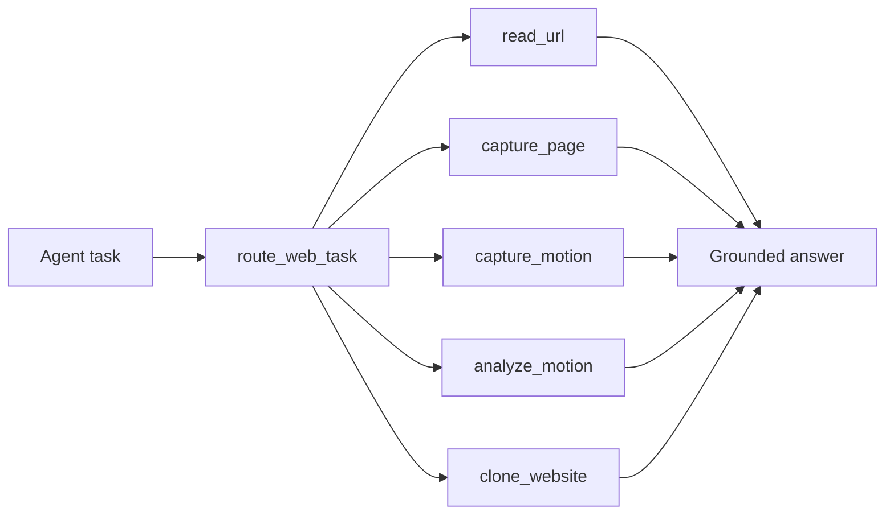

# RenderProof

**Rendered web evidence for coding agents.**

RenderProof is a local-first MCP server that lets Codex, Claude Code, Cursor, and other agents capture what Chromium actually rendered: screenshots, motion, CSS animation metadata, pixel diffs, gates, loading states, and visual evidence that plain fetch tools miss.

It is not a scraper. It is not a bypass tool. It is the receipt for what the browser saw.

## Why This Exists

Coding agents are very good at reading source. The web is increasingly bad at being understood from source alone.

Modern pages hide their real state behind client rendering, consent walls, cookie modals, skeleton loaders, canvas, video surfaces, iframes, maps, bot checks, and motion. A text fetch can say "Google Maps"; a browser screenshot can show "Danish consent wall blocking the map."

RenderProof gives agents a grounded visual evidence layer before they make claims or copy a design.

## What It Does

| Tool | Use it when | Output |
| --- | --- | --- |
| `route_web_task` | The agent needs to choose text, screenshot, motion, search, or another platform tool | Route recommendation with evidence |
| `read_url` | Text is enough | Normalized direct fetch text, with optional remote reader |
| `capture_page` | Layout, gates, rendered state, canvas, images, maps, PDFs-as-browser-state, or visual QA matter | PNG screenshot + metadata |
| `capture_motion` | A human needs to see animation, loading, scroll, transitions, or media motion | WebM video + keyframe PNGs |
| `analyze_motion` | A coding agent needs to recreate or critique motion | Contact sheet, diff image, CSS animation metadata, pixel-diff JSON, design notes |
| `clone_website` | A coding agent needs to rebuild an authorized website or study how a page is put together | Clone brief, desktop/mobile screenshots, design tokens, assets, topology, behaviors, component specs |
| `doctor` | You want to verify local runtime/browser setup | Runtime and Playwright checks |

## The Core Idea



RenderProof makes the expensive path explicit: read text first when text is enough, escalate to rendered evidence when pixels matter.

## Example Prompts

```text
Use RenderProof to capture a full-page screenshot of https://example.com with autoScrollBeforeCapture true.
```

```text
Use RenderProof to analyze the animation style on this page and return the contact sheet, pixel-diff summary, and CSS animation metadata.
```

```text
Use RenderProof to check what the browser actually sees on this Instagram/TikTok/YouTube page.
```

```text
Use RenderProof to capture visual evidence before claiming whether this page is blocked by a consent wall, login wall, CAPTCHA, or skeleton loader.
```

```text
Use RenderProof clone_website on https://example.com and give me the clone brief paths for a Next.js rebuild.
```

## Motion Analysis

Video is useful for humans. Agents need structured evidence.

`analyze_motion` samples frames over time and returns:

- a contact sheet PNG
- a red-highlight diff PNG
- frame timestamps
- changed-pixel ratios
- changed-region bounds and centroid movement
- dominant movement direction
- `document.getAnimations()` metadata
- CSS keyframes, duration, easing, direction, iterations, target selector, animated properties
- design notes written for a coding agent

Example design notes:

```json
[
  "Detected 2 CSS/Web Animation target(s), affecting transform.",
  "Primary timing appears to use duration 1200ms, easing ease-in-out, direction alternate.",
  "Pixel sampling saw up to 5.81% of sampled pixels change between adjacent frames.",
  "The changed region centroid trends right across sampled frames."
]
```

That is the difference between "there is an animation" and "recreate this with transform, 1200ms, ease-in-out, alternate, moving right while scaling."

## Website Clone Briefs

`clone_website` turns a live rendered page into clone-ready artifacts for an AI coding workflow. It is inspired by section-by-section website reverse-engineering templates: inspect first, write durable specs, then build from those specs.

It writes a local bundle under `.renderproof/evidence/clones/`:

- `research/CLONE_BRIEF.md`
- `research/DESIGN_TOKENS.md`
- `research/PAGE_TOPOLOGY.md`
- `research/BEHAVIORS.md`
- `research/components/*.spec.md`
- `design-references/desktop-*.png`
- `design-references/mobile-*.png`
- downloaded assets, capped by `maxAssets` and `maxAssetBytes`

The output is not a completed app. It is the extraction layer a coding agent needs before rebuilding: exact rendered references, computed CSS signals, real text, asset paths, interaction hints, and responsive evidence.

## Install

One-liner:

```bash
curl -fsSL https://raw.githubusercontent.com/Djsand/renderproof/main/install.sh | bash -s -- codex
```

Windows PowerShell:

```powershell
powershell -NoProfile -ExecutionPolicy Bypass -Command "& ([scriptblock]::Create((irm https://raw.githubusercontent.com/Djsand/renderproof/main/install.ps1))) -Target codex"
```

Swap `codex` for `claude`, `cursor`, `cline`, `windsurf`, `gemini`, or `generic`.

The `codex` target writes directly to `~/.codex/config.toml`, so it works even when the Codex CLI is not available in your terminal PATH.

If Windows says `Missing required command: node`, install Node.js 20+ and reopen PowerShell:

```powershell
winget install OpenJS.NodeJS.LTS
```

Manual install:

```bash
git clone https://github.com/Djsand/renderproof.git
cd renderproof
npm install
npx playwright install chromium
```

Then install it into your coding agent:

```bash
node dist/index.js install
```

One-liners:

```bash
curl -fsSL https://raw.githubusercontent.com/Djsand/renderproof/main/install.sh | bash -s -- codex
curl -fsSL https://raw.githubusercontent.com/Djsand/renderproof/main/install.sh | bash -s -- claude
curl -fsSL https://raw.githubusercontent.com/Djsand/renderproof/main/install.sh | bash -s -- cursor
curl -fsSL https://raw.githubusercontent.com/Djsand/renderproof/main/install.sh | bash -s -- cline
curl -fsSL https://raw.githubusercontent.com/Djsand/renderproof/main/install.sh | bash -s -- windsurf
curl -fsSL https://raw.githubusercontent.com/Djsand/renderproof/main/install.sh | bash -s -- gemini
```

Windows PowerShell one-liners:

```powershell
powershell -NoProfile -ExecutionPolicy Bypass -Command "& ([scriptblock]::Create((irm https://raw.githubusercontent.com/Djsand/renderproof/main/install.ps1))) -Target codex"
powershell -NoProfile -ExecutionPolicy Bypass -Command "& ([scriptblock]::Create((irm https://raw.githubusercontent.com/Djsand/renderproof/main/install.ps1))) -Target claude"
powershell -NoProfile -ExecutionPolicy Bypass -Command "& ([scriptblock]::Create((irm https://raw.githubusercontent.com/Djsand/renderproof/main/install.ps1))) -Target cursor"
powershell -NoProfile -ExecutionPolicy Bypass -Command "& ([scriptblock]::Create((irm https://raw.githubusercontent.com/Djsand/renderproof/main/install.ps1))) -Target cline"
powershell -NoProfile -ExecutionPolicy Bypass -Command "& ([scriptblock]::Create((irm https://raw.githubusercontent.com/Djsand/renderproof/main/install.ps1))) -Target windsurf"
powershell -NoProfile -ExecutionPolicy Bypass -Command "& ([scriptblock]::Create((irm https://raw.githubusercontent.com/Djsand/renderproof/main/install.ps1))) -Target gemini"
```

Local helper equivalents:

```bash
node dist/index.js install codex --write-user
node dist/index.js install claude --apply
node dist/index.js install cursor --write-project
node dist/index.js install cline --write-user
node dist/index.js install windsurf --write-user
node dist/index.js install gemini --apply --scope user
```

See [docs/installation.md](docs/installation.md) for agent-specific setup.

## Use With Codex

```bash
node dist/index.js install codex --write-user
```

Manual equivalent:

```bash
codex mcp add renderproof -- node /absolute/path/to/renderproof/dist/index.js mcp
```

Direct config equivalent:

```toml
[mcp_servers.renderproof]
command = "node"
args = ["/absolute/path/to/renderproof/dist/index.js", "mcp"]
```

## Use With Claude Code

```bash
node dist/index.js install claude --apply
```

Manual equivalent:

```bash
claude mcp add renderproof -- node /absolute/path/to/renderproof/dist/index.js mcp
```

## Use As CLI

```bash
npm run dev -- route "summarize this page" --url https://example.com
npm run dev -- read https://example.com
npm run dev -- capture https://example.com --full-page
npm run dev -- capture https://example.com --full-page --auto-scroll
npm run dev -- motion https://example.com --duration 5000 --keyframes true
npm run dev -- analyze-motion https://example.com --duration 3000 --samples 5
npm run dev -- clone-website https://example.com --max-sections 24
npm run dev -- install generic --json
npm run doctor
```

## Safety Model

RenderProof is designed to show gates, not bypass them.

By default, it:

- allows public `http` and `https` URLs
- blocks `localhost`, private IP ranges, and hosts resolving to private IPs
- does not use remote readers unless explicitly enabled
- does not solve CAPTCHA
- does not hide automation
- does not click through consent, login, or payment walls
- does not use clone outputs for phishing, impersonation, or unauthorized reproduction
- returns structured failures instead of pretending a page was accessible

Environment controls:

```bash
RENDERPROOF_ALLOWED_HOSTS=example.com,*.example.org
RENDERPROOF_ALLOW_PRIVATE_NETWORK=1
RENDERPROOF_ENABLE_REMOTE_READERS=1
RENDERPROOF_OUTPUT_DIR=.renderproof/evidence
RENDERPROOF_MAX_CHARS=12000
JINA_API_KEY=...
```

Legacy `GROUNDED_WEB_*` variables are still supported for compatibility.

## What RenderProof Is Good At

- Seeing rendered browser state when direct fetch returns useless HTML
- Capturing cookie modals, login walls, consent walls, reCAPTCHA widgets, and skeleton loaders
- Capturing maps, video players, image pages, canvas/WebGL surfaces, and JS-computed UI
- Producing full-page screenshots with optional pre-scroll for lazy loading
- Recording short WebM motion evidence for humans
- Turning animation into agent-readable CSS and pixel-diff evidence
- Creating auditable local evidence files for coding workflows
- Generating clone briefs for authorized rebuilds, migrations, and learning

## What It Will Not Do

- bypass paywalls, login walls, CAPTCHA, bot checks, or private networks by default
- scrape social platforms as a data product
- replace Playwright MCP for interactive browser control
- guarantee semantic object tracking from pixel diffs alone
- produce a finished application from a clone brief without a coding agent doing the build and QA

Playwright is the engine. RenderProof is the evidence layer.

## Development

```bash
npm install
npm run typecheck
npm run build
npm run doctor
```

Run a browser launch check:

```bash
npm run dev -- doctor --check-browser-launch
```

## Roadmap

- PDF rendering and text extraction
- page-state detection for consent/login/CAPTCHA/skeleton/download/blank-page states
- visual diff scoring for clone QA workflows
- safe user-provided auth/session support
- evidence bundle manifests
- optional interaction sequences with before/after evidence

## License

MIT
